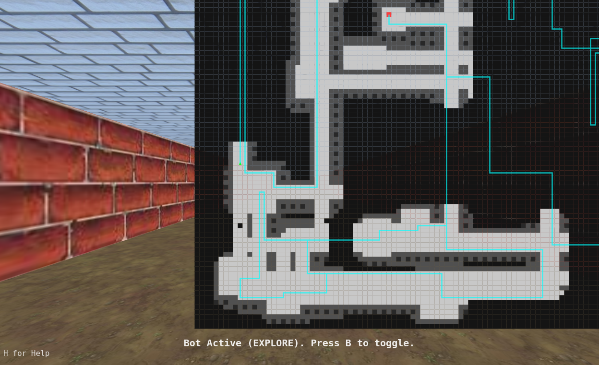

# js_mazelabyrinth_redux

### Play it now: https://pemmyz.github.io/js_mazelabyrinth_redux/

---
---
## Screenshots

### Game

# Maze Game WebGL

A 3D maze exploration game rendered using WebGL with:
- Intelligent bot navigation (BFS, DFS, A*, and Explore)
- Fullscreen and draggable 2D map overlay
- Auto-starting bot if the player is idle
- Exit detection and automatic maze regeneration
- Smooth player movement and rotation animations

---

## 🎮 Features

- 🔁 **Procedural Maze Generation**
  - NetHack-style rooms and corridors
  - Auto-connected with hallways
  - Randomized on each run (with seeding)
  
- 🤖 **Bot Modes**
  - `1`: Breadth-First Search (BFS)
  - `2`: Depth-First Search (DFS)
  - `3`: A* Search
  - `4`: Explore all rooms then find the exit
  - Bot automatically starts after 7s of idle

- 🧭 **2D Map Overlay**
  - Toggle full map view with **M**
  - Drag to pan map view
  - Minimap displayed by default

- 🕹️ **Smooth Player Controls**
  - `W / ↑`: Move Forward
  - `S / ↓`: Move Backward
  - `A / ←`: Turn Left
  - `D / →`: Turn Right

- ❓ **Help Overlay**
  - Toggle with **H** to show controls and keys

---

Used textures:
- https://opengameart.org/content/tileable-dirt-textures
- https://opengameart.org/content/bricks-tiled-texture-64x64
- https://opengameart.org/content/50-free-textures-5-with-normalmaps?page=2
- https://opengameart.org/content/exit-sign-64
